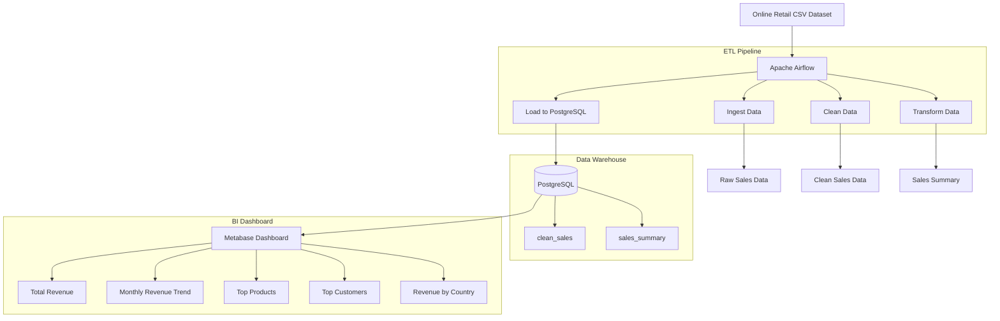

````markdown
# 🛒 E-Commerce Sales Analytics Pipeline

## 📌 Project Overview

This project is an end-to-end Data Engineering pipeline designed to process and analyze e-commerce transaction data using Apache Airflow, PostgreSQL, Docker, and Metabase.

The objective of this project is to automate the complete ETL workflow—from raw sales data ingestion to business intelligence visualization—while demonstrating modern Data Engineering architecture concepts such as orchestration, containerization, data warehousing, and dashboard analytics.

The pipeline processes retail transaction records from an online retail dataset, performs data cleaning and transformation, generates business metrics, stores analytical datasets in PostgreSQL, and visualizes business insights through interactive dashboards.

---

# ✨ Key Features

- Automated ETL workflow orchestration using Apache Airflow
- Containerized environment using Docker & Docker Compose
- Data cleaning and preprocessing with Pandas
- Business metric generation and aggregation
- PostgreSQL Data Warehouse integration
- SQL-based analytics and reporting
- Interactive BI dashboard using Metabase
- Modular pipeline structure for scalability and maintainability

---

# 🏗️ Architecture Diagram

The pipeline follows a Batch Processing architecture orchestrated by Apache Airflow within a Dockerized environment.

The workflow can be summarized as follows:

- Ingestion Layer: Reads raw CSV sales data into the pipeline
- Processing Layer: Cleans, validates, and transforms the dataset
- Warehouse Layer: Stores cleaned and aggregated analytical tables in PostgreSQL
- Presentation Layer: Displays business insights via Metabase dashboards



---

# 🛠️ Dataset & Tech Stack

## 📊 Dataset Source

### Online Retail Dataset (Kaggle)

The dataset contains real-world e-commerce transaction data including:

- Invoice transactions
- Product descriptions
- Quantities sold
- Unit prices
- Customer IDs
- Transaction timestamps
- Country information

---

# 💻 Tech Stack

| Technology | Purpose |
|---|---|
| Apache Airflow | Workflow orchestration |
| Docker & Docker Compose | Containerization |
| Python | ETL scripting |
| Pandas | Data processing |
| PostgreSQL | Data warehouse |
| SQLAlchemy | Database connection |
| Metabase | Business intelligence dashboard |

---

# 📂 Project Structure

The repository is organized to simulate a modern Data Engineering project structure.

```bash
ecommerce-pipeline/
│
├── dags/                            # Airflow DAGs
│   └── ecommerce_pipeline.py
│
├── scripts/                         # ETL scripts
│   ├── ingest.py                    # Data ingestion
│   ├── clean.py                     # Data cleaning
│   ├── transform.py                 # Data transformation
│   └── load.py                      # PostgreSQL loading
│
├── data/                            # Raw dataset
│   └── Online Retail.csv
│
├── sql/                             # SQL scripts
│
├── logs/                            # Airflow logs
│
├── plugins/                         # Airflow plugins
│
├── docker-compose.yml               # Docker services
├── Dockerfile                       # Custom Airflow image
├── requirements.txt                 # Python dependencies
├── .gitignore                       # Git ignore rules
├── README.md                        # Project documentation
│
└── images/                          # Screenshots
    ├── airflow.png
    ├── dashboard.png
    └── architecture.png
```

---

# ⚙️ ETL Pipeline Workflow

## 1️⃣ Ingestion Layer

### Status
Raw Data

### Process

The ingestion process reads the raw CSV dataset into the ETL pipeline using Pandas.

### Tasks

- Read dataset from CSV
- Validate dataset structure
- Initialize ETL workflow

### Example

```python
df = pd.read_csv('/opt/airflow/data/Online Retail.csv')
```

---

## 2️⃣ Cleaning Layer

### Status
Cleaned & Validated Data

### Process

The cleaning stage ensures data quality before transformation and analytics.

### Cleaning Operations

- Remove null CustomerID values
- Remove duplicate rows
- Convert InvoiceDate to datetime
- Remove invalid Quantity values
- Remove negative UnitPrice values

### Example

```python
df = df.dropna(subset=["CustomerID"])
df = df[df["Quantity"] > 0]
```

---

## 3️⃣ Transformation Layer

### Status
Business-Ready Data

### Process

The transformation stage generates business metrics and analytical datasets.

### Generated Metrics

- Revenue
- Monthly sales trend
- Product performance
- Customer spending analytics

### Revenue Calculation

```python
df["revenue"] = df["Quantity"] * df["UnitPrice"]
```

### Monthly Revenue Aggregation

```python
monthly_sales = df.groupby("month")["revenue"].sum()
```

---

## 4️⃣ Warehouse Layer

### Status
Analytical Data Warehouse

### Process

The transformed datasets are loaded into PostgreSQL for analytics and dashboard visualization.

### Warehouse Tables

| Table | Purpose |
|---|---|
| clean_sales | Cleaned transaction data |
| sales_summary | Monthly aggregated analytics |

### Example

```python
df.to_sql(
    "clean_sales",
    engine,
    if_exists="replace",
    index=False
)
```

---

# 🌬️ Apache Airflow DAG

Apache Airflow orchestrates the complete ETL workflow.

## DAG Workflow

```text
ingest_data
    ↓
clean_data
    ↓
transform_data
    ↓
load_to_postgres
```

## DAG Features

- Automated task dependency
- Retry mechanism
- Workflow monitoring
- Modular ETL orchestration

---

# 🐳 Docker Configuration

## requirements.txt

Project dependencies are managed using a requirements.txt file.

### Example

```text
pandas
sqlalchemy
psycopg2-binary
```

---

# 🐳 Dockerfile

A custom Airflow image is built to install the required Python dependencies.

## Dockerfile

```dockerfile
FROM apache/airflow:2.9.1

USER airflow

COPY requirements.txt .

RUN pip install --no-cache-dir -r requirements.txt
```

---

# 🐳 docker-compose.yml

Docker Compose is used to orchestrate the services.

## Services Included

- Apache Airflow
- PostgreSQL
- Metabase

### Example Volume Mapping

```yaml
volumes:
  - ./dags:/opt/airflow/dags
  - ./scripts:/opt/airflow/scripts
  - ./data:/opt/airflow/data
```

---

# 🚀 Setup & Installation

## 1️⃣ Prerequisites

### Required Software

- Docker Desktop
- Docker Compose
- VS Code (Recommended)

---

# 2️⃣ Project Initialization

Clone the repository:

```bash
git clone <repository_url>
```

Navigate to the project folder:

```bash
cd ecommerce-pipeline
```

---

# 3️⃣ Build & Start Docker Environment

Run:

```bash
docker compose up --build -d
```

---

# 4️⃣ Access Services

## Apache Airflow

```text
http://localhost:8080
```

### Login Credentials

| Username | Password |
|---|---|
| admin | admin |

---

## Metabase

```text
http://localhost:3000
```

---

# 🐘 PostgreSQL Configuration

| Config | Value |
|---|---|
| Host | postgres |
| Port | 5432 |
| Database | ecommerce |
| Username | admin |
| Password | admin |

---

# 🧪 Running the Pipeline

## Trigger DAG

1. Open Airflow UI
2. Enable DAG
3. Trigger DAG manually

The pipeline workflow:

```text
ingest → clean → transform → load
```

---

# 📊 SQL Analytics

The project generates analytical insights using SQL queries.

## 💰 Total Revenue

```sql
SELECT SUM(revenue)
FROM clean_sales;
```

---

## 🏆 Top Products

```sql
SELECT "Description",
SUM(revenue) AS total_revenue
FROM clean_sales
GROUP BY "Description"
ORDER BY total_revenue DESC
LIMIT 10;
```

---

## 📈 Monthly Revenue Trend

```sql
SELECT month, revenue
FROM sales_summary
ORDER BY month;
```

---

## 👤 Top Customers

```sql
SELECT 
    "CustomerID",
    SUM(revenue) AS total_spending
FROM clean_sales
GROUP BY "CustomerID"
ORDER BY total_spending DESC
LIMIT 10;
```

---

# 📊 Metabase Dashboard

The Metabase dashboard visualizes business insights generated from the ETL pipeline.

## Dashboard Components

### 💰 Sales Overview
- Total Revenue
- Total Orders

### 📈 Revenue Analytics
- Monthly Revenue Trend

### 🏆 Product Analytics
- Top Products

### 👤 Customer Analytics
- Top Customers

### 🌍 Geographic Analytics
- Revenue by Country

---

# 🧠 Business Insights

## Revenue Trends
- Revenue increased significantly during holiday periods.
- Q4 generated the highest sales volume.

## Customer Behavior
- A small percentage of customers contributed most revenue.
- Repeat customers had significantly higher spending behavior.

## Product Performance
- Certain products dominated overall revenue contribution.
- Some products sold frequently but generated lower revenue.

## Geographic Analysis
- United Kingdom generated the highest total revenue.
- International transactions had lower purchase frequency.

---

# 📸 Sample Outputs

## Airflow DAG
- ETL workflow execution
- Task dependency management

## Metabase Dashboard
- Business KPI visualization
- Revenue analytics
- Product insights

---

# 🛑 Stop Containers

```bash
docker compose down
```

---

# 📌 Future Improvements

- Add Apache Spark processing
- Implement incremental loading
- Add real-time streaming ingestion
- Deploy to cloud infrastructure
- Add monitoring & alerting system

---

# 👤 Author

**Purita Liewtrakoon**  
Data Engineering Project

---

# 📄 License

This project is developed for educational and portfolio purposes.
````