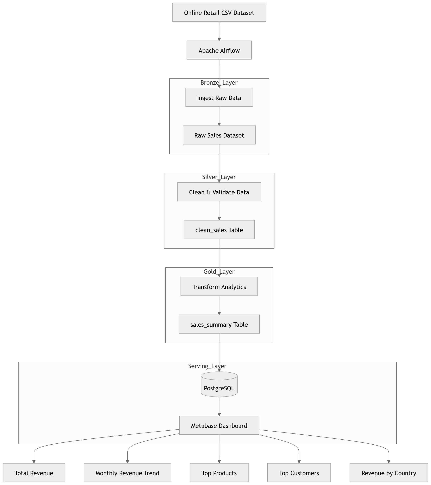
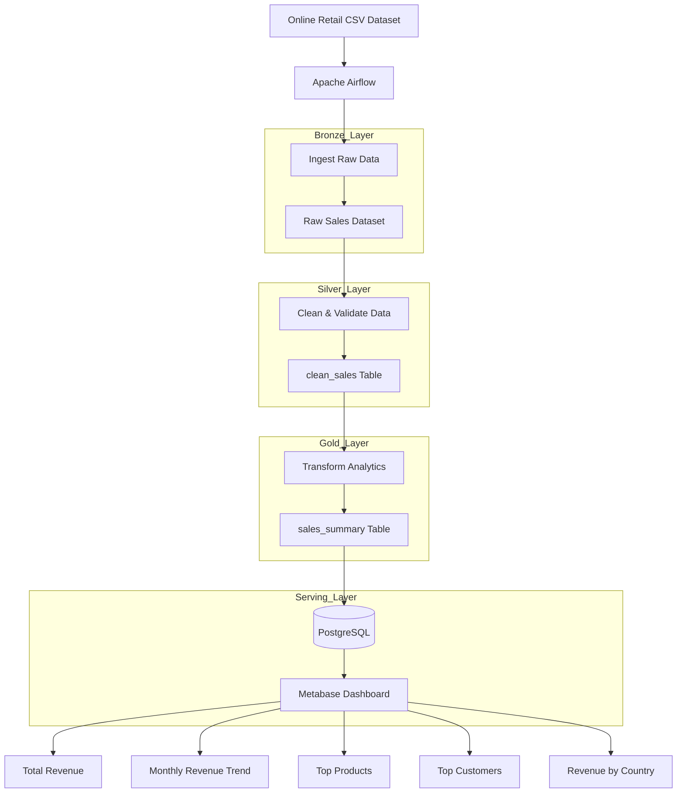
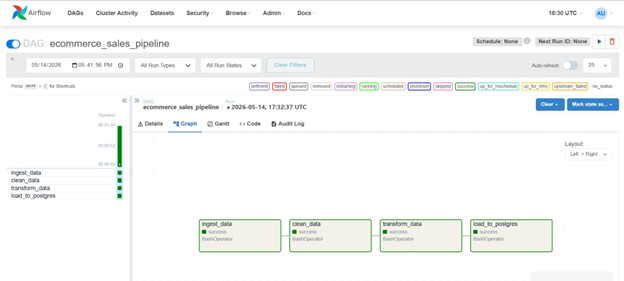
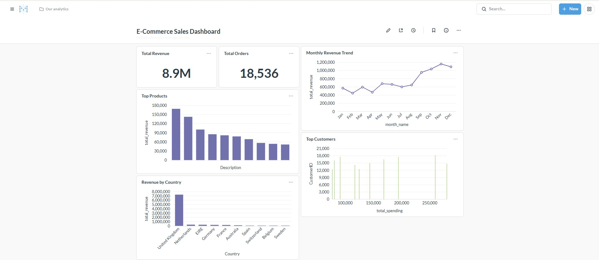

````markdown
# 🛒 E-Commerce Sales Analytics Pipeline

## 📌 Project Overview

This project is an end-to-end Data Engineering pipeline designed to process and analyze e-commerce transaction data using Apache Airflow, PostgreSQL, Docker, and Metabase.

The main objective of this project is to automate the complete ETL workflow—from raw sales data ingestion to business intelligence visualization—while demonstrating modern Data Engineering concepts such as workflow orchestration, ETL processing, containerization, data warehousing, and dashboard analytics.

The pipeline processes retail transaction records from the Online Retail dataset, performs data cleaning and transformation, generates business metrics, stores analytical datasets in PostgreSQL, and visualizes business insights through interactive dashboards.

---

# ✨ Key Features

- Automated ETL workflow orchestration using Apache Airflow
- Containerized environment using Docker & Docker Compose
- Data cleaning and preprocessing using Pandas
- Layer-based ETL architecture (Bronze / Silver / Gold)
- PostgreSQL Data Warehouse integration
- SQL analytics and reporting
- Interactive business dashboard using Metabase
- Modular pipeline structure for scalability and maintainability

---

# 🏗️ Architecture Diagram



The pipeline follows a Batch Processing architecture orchestrated by Apache Airflow within a Dockerized environment.

The workflow can be summarized as:

- Bronze Layer: Raw CSV data ingestion
- Silver Layer: Data cleaning and validation
- Gold Layer: Business analytics and aggregation
- Serving Layer: PostgreSQL warehouse & Metabase dashboard



---

# 🛠️ Dataset & Tech Stack

## 📊 Dataset Source

### Online Retail Dataset (Kaggle)

The dataset contains real-world e-commerce transaction data including:

- Invoice transactions
- Product descriptions
- Quantities sold
- Unit prices
- Customer IDs
- Transaction timestamps
- Country information

---

# 💻 Tech Stack

| Technology              | Purpose                         |
| ----------------------- | ------------------------------- |
| Apache Airflow          | Workflow orchestration          |
| Docker & Docker Compose | Containerization                |
| Python                  | ETL scripting                   |
| Pandas                  | Data processing                 |
| PostgreSQL              | Data warehouse                  |
| SQLAlchemy              | Database connection             |
| Metabase                | Business intelligence dashboard |

---

# 📂 Project Structure

```bash
ecommerce-pipeline/
│
├── dags/
│   └── ecommerce_pipeline.py
│
├── scripts/
│   ├── ingest.py
│   ├── clean.py
│   ├── transform.py
│   └── load.py
│
├── data/
│   └── Online Retail.csv
│
├── sql/
│
├── logs/
│
├── plugins/
│
├── docker-compose.yml
├── Dockerfile
├── requirements.txt
├── .gitignore
├── README.md
│
└── images/
    ├── airflow.jpg
    ├── dashboard.jpg
    └── architecture.png
```

---

# ⚙️ Data Pipeline Layers

## 🥉 Bronze Layer (Raw Data)

### Status

Raw transactional dataset

### Process

The Bronze Layer ingests the original Online Retail CSV dataset into the ETL workflow without modification. This layer preserves the raw source data for reproducibility and auditing purposes.

### Main Tasks

- Read raw CSV dataset
- Validate dataset structure
- Initialize ETL workflow

### Example

```python
df = pd.read_csv('/opt/airflow/data/Online Retail.csv')
```

---

## 🥈 Silver Layer (Cleaned Data)

### Status

Cleaned and validated data

### Process

The Silver Layer performs data preprocessing and quality checks to improve analytical reliability before loading into the warehouse.

### Cleaning Operations

- Remove null CustomerID values
- Remove duplicate rows
- Convert InvoiceDate to datetime
- Remove invalid Quantity values
- Remove negative UnitPrice values

### Generated Table

- clean_sales

### Example

```python
df = df.dropna(subset=["CustomerID"])
df = df[df["Quantity"] > 0]
```

---

## 🥇 Gold Layer (Business Analytics)

### Status

Business-ready analytical data

### Process

The Gold Layer generates aggregated business metrics and analytical datasets for reporting and dashboard visualization.

### Generated Analytics

- Monthly revenue trends
- Top-selling products
- Top customers
- Revenue by country
- KPI metrics

### Generated Tables

- sales_summary

### Revenue Calculation

```python
df["revenue"] = df["Quantity"] * df["UnitPrice"]
```

### Monthly Aggregation

```python
monthly_sales = df.groupby("month")["revenue"].sum()
```

---

# 🌬️ Apache Airflow DAG

Apache Airflow orchestrates the ETL workflow and manages task dependencies.

## DAG Workflow

```text
ingest_data
    ↓
clean_data
    ↓
transform_data
    ↓
load_to_postgres
```

## DAG Features

- Automated task scheduling
- Retry mechanism
- Workflow monitoring
- Task dependency management
- Modular ETL orchestration

---

# 📸 Apache Airflow DAG Output



- ETL workflow execution
- Task dependency monitoring

---

# 🐳 Docker Configuration

## requirements.txt

```text
pandas
sqlalchemy
psycopg2-binary
```

---

## Dockerfile

```dockerfile
FROM apache/airflow:2.9.1

USER airflow

COPY requirements.txt .

RUN pip install --no-cache-dir -r requirements.txt
```

---

## docker-compose.yml

### Services Included

- Apache Airflow
- PostgreSQL
- Metabase

### Example Volume Mapping

```yaml
volumes:
  - ./dags:/opt/airflow/dags
  - ./scripts:/opt/airflow/scripts
  - ./data:/opt/airflow/data
```

---

# 🚀 Setup & Installation

## 1️⃣ Prerequisites

Required software:

- Docker Desktop
- Docker Compose
- VS Code (Recommended)

---

## 2️⃣ Clone Repository

```bash
git clone https://github.com/lilmipert/ecommerce-sales-pipeline.git
```

```bash
cd ecommerce-sales-pipeline
```

---

## 3️⃣ Build & Start Docker Environment

```bash
docker compose up --build -d
```

---

# 🌐 Access Services

## Apache Airflow

```text
http://localhost:8080
```

### Login Credentials

| Username | Password |
| -------- | -------- |
| admin    | admin    |

---

## Metabase

```text
http://localhost:3000
```

---

# 🐘 PostgreSQL Configuration

| Config   | Value     |
| -------- | --------- |
| Host     | postgres  |
| Port     | 5432      |
| Database | ecommerce |
| Username | admin     |
| Password | admin     |

---

# 🧪 Running the Pipeline

## Trigger DAG

1. Open Airflow UI
2. Enable DAG
3. Trigger DAG manually

Pipeline workflow:

```text
ingest → clean → transform → load
```

---

# 📊 SQL Analytics

## 💰 Total Revenue

```sql
SELECT SUM(revenue)
FROM clean_sales;
```

---

## 📈 Monthly Revenue Trend

```sql
SELECT month, revenue
FROM sales_summary
ORDER BY month;
```

---

## 🏆 Top Products

```sql
SELECT "Description",
SUM(revenue) AS total_revenue
FROM clean_sales
GROUP BY "Description"
ORDER BY total_revenue DESC
LIMIT 10;
```

---

## 👤 Top Customers

```sql
SELECT 
    "CustomerID",
    SUM(revenue) AS total_spending
FROM clean_sales
GROUP BY "CustomerID"
ORDER BY total_spending DESC
LIMIT 10;
```

---

## 🌍 Revenue by Country

```sql
SELECT 
    "Country",
    SUM(revenue) AS total_revenue
FROM clean_sales
GROUP BY "Country"
ORDER BY total_revenue DESC
LIMIT 10;
```

---

# 📊 Metabase Dashboard



The Metabase dashboard visualizes business insights generated from the ETL pipeline.

## Dashboard Components

### 💰 Sales Overview

- Total Revenue
- Total Orders

### 📈 Revenue Analytics

- Monthly Revenue Trend

### 🏆 Product Analytics

- Top Products

### 👤 Customer Analytics

- Top Customers

### 🌍 Geographic Analytics

- Revenue by Country

---

# 🧠 Business Insights

## Revenue Trends

- Revenue increased significantly during holiday periods
- Q4 generated the highest sales volume

## Customer Behavior

- A small percentage of customers contributed most revenue
- Repeat customers generated higher spending behavior

## Product Performance

- Certain products dominated total revenue contribution
- Some products sold frequently but generated lower revenue

## Geographic Analysis

- United Kingdom generated the highest revenue
- International transactions had lower purchase frequency

---

# 🛑 Stop Containers

```bash
docker compose down
```

---

# 📌 Future Improvements

- Add Apache Spark processing
- Implement incremental loading
- Add real-time streaming ingestion
- Deploy to cloud infrastructure
- Add monitoring & alerting systems

---

# 👤 Author

**Purita Liewtrakoon**  
Data Engineering Project

---

# 📄 License

This project is developed for educational and portfolio purposes.
````