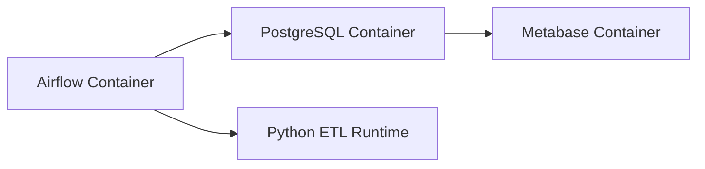
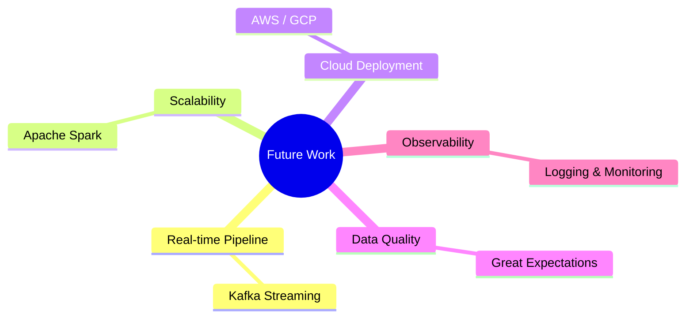

🛒 E-Commerce Sales Analytics Platform (Data Engineering Pipeline)
==================================================================

📌 Project Overview
-------------------

This project is a **production-style Data Engineering pipeline** designed to simulate a real-world e-commerce analytics platform.

It processes raw transactional data through a multi-layer ETL architecture, orchestrates workflows using Apache Airflow, and delivers business insights via PostgreSQL and Metabase.

The system demonstrates modern Data Engineering practices:
- Batch ETL pipeline design
- Layered architecture (Bronze / Silver / Gold)
- Workflow orchestration with Airflow
- Data warehouse modeling
- Containerized infrastructure (Docker)

---

🏗️ System Architecture
-----------------------

🔷 Architecture Diagram (Mermaid)

```mermaid
flowchart TD

A[Raw CSV Data] --> B[Airflow DAG Trigger]

B --> C[Bronze Layer<br>Raw Ingestion]
C --> D[Silver Layer<br>Cleaning & Validation]
D --> E[Gold Layer<br>Business Aggregation]

E --> F[(PostgreSQL Data Warehouse)]
F --> G[Metabase Dashboard]

````

---

⚙️ ETL Pipeline Flow

🔁 End-to-End Workflow

```mermaid
sequenceDiagram
participant User
participant Airflow
participant Python
participant Postgres
participant Metabase

User->>Airflow: Trigger DAG
Airflow->>Python: Run ingestion task
Python->>Postgres: Load Bronze data

Airflow->>Python: Run cleaning task
Python->>Postgres: Load Silver data

Airflow->>Python: Run transformation task
Python->>Postgres: Load Gold tables

Metabase->>Postgres: Query analytics tables
Postgres-->>Metabase: Return KPIs & insights
```

---

 ✨ Key Features

* Fully automated ETL pipeline
* Airflow DAG orchestration
* Multi-layer data architecture
* Data validation & cleaning logic
* Business KPI generation
* PostgreSQL warehouse design
* BI dashboard integration (Metabase)
* Dockerized microservice environment

---

🛠️ Tech Stack

```text
Orchestration     → Apache Airflow
Processing        → Python (Pandas)
Data Warehouse    → PostgreSQL
Transformation    → SQL + Python
Infrastructure    → Docker / Docker Compose
Visualization     → Metabase
```

---

📂 ETL Code Examples

🥉 Bronze Layer (Raw Ingestion)

```python
import pandas as pd

def load_raw_data():
    df = pd.read_csv("/opt/airflow/data/online_retail.csv")
    return df
```

---

🥈 Silver Layer (Cleaning & Validation)

```python
def clean_data(df):
    df = df.dropna(subset=["CustomerID"])
    df = df[df["Quantity"] > 0]
    df = df[df["UnitPrice"] > 0]

    df["InvoiceDate"] = pd.to_datetime(df["InvoiceDate"])

    return df
```

---

🥇 Gold Layer (Business Aggregation)

```python
def create_sales_metrics(df):
    df["revenue"] = df["Quantity"] * df["UnitPrice"]

    monthly_revenue = (
        df.groupby(df["InvoiceDate"].dt.to_period("M"))
        .agg(total_revenue=("revenue", "sum"))
        .reset_index()
    )

    return monthly_revenue
```

---
 🌬️ Airflow DAG (Core Pipeline)

```python
from airflow import DAG
from airflow.operators.python import PythonOperator
from datetime import datetime

from etl import load_raw_data, clean_data, create_sales_metrics

def run_pipeline():
    df = load_raw_data()
    df = clean_data(df)
    df = create_sales_metrics(df)
    df.to_sql("gold_sales", con=engine, if_exists="replace")

with DAG(
    dag_id="ecommerce_etl_pipeline",
    start_date=datetime(2024, 1, 1),
    schedule_interval="@daily",
    catchup=False
) as dag:

    task_etl = PythonOperator(
        task_id="run_etl_pipeline",
        python_callable=run_pipeline
    )

task_etl
```

---

🐳 Docker Architecture



---
📊 Example SQL Analytics
💰 Total Revenue


```sql
SELECT SUM(revenue) AS total_revenue
FROM gold_sales;
```

📈 Monthly Trend

```sql
SELECT month, total_revenue
FROM sales_summary
ORDER BY month;
```

🏆 Top Products

```sql
SELECT Description,
       SUM(revenue) AS revenue
FROM gold_sales
GROUP BY Description
ORDER BY revenue DESC
LIMIT 10;
```

---

 📌 Production Design Principles

* Idempotent pipeline execution
* Stateless transformation logic
* Layered architecture (Bronze → Gold)
* Modular ETL functions
* Containerized reproducibility
* DAG-based orchestration
* Separation of compute & storage

---
🚀 Future Improvements



---
👤 Author

**Purita Liewtrakoon**
66102010183 | DE241 Final Project

---

```

---
